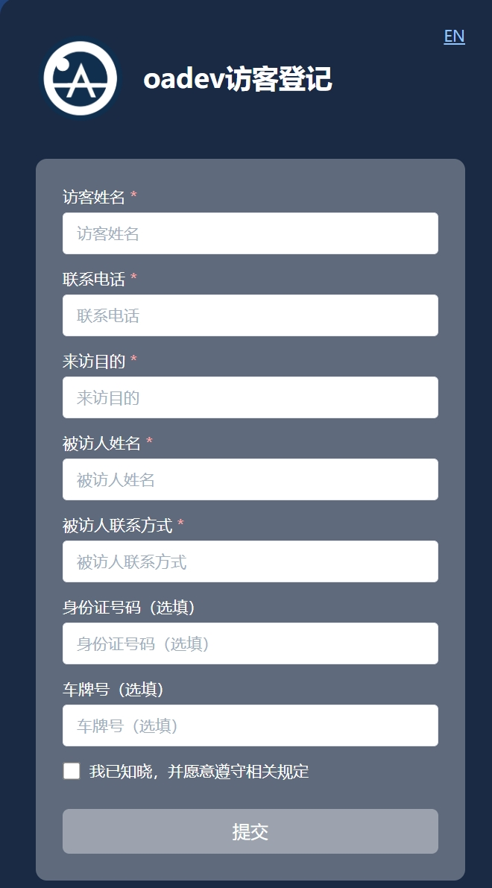
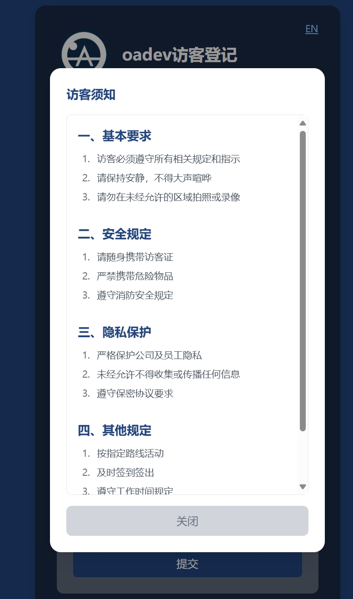
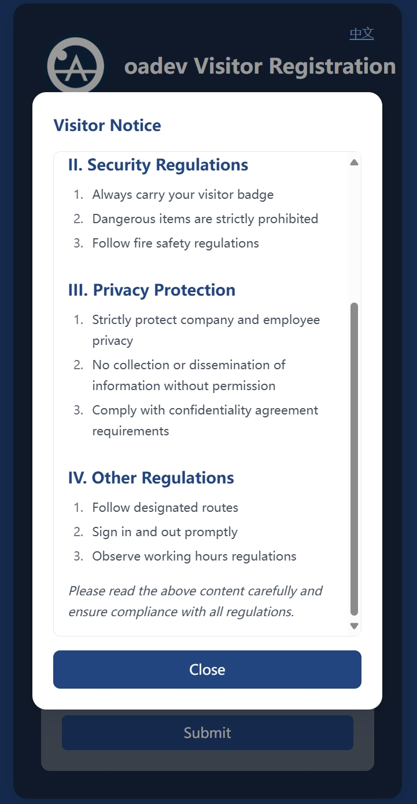

# 访客登记系统 / Visitor Registration System

一个现代化的访客登记系统，支持中英文双语界面，美观的UI设计和完善的表单验证。

## 功能特性

### 1. 多语言支持
- 支持中英文切换
- 表单标签、提示信息自动切换语言
- 日期选择器根据语言自动调整显示格式和界面
- 访客须知支持多语言 Markdown 内容

### 2. 表单功能
- 必填字段：
  - 访客姓名
  - 联系电话
  - 来访日期
  - 来访目的
  - 被访人姓名
  - 被访人联系方式
- 选填字段：
  - 身份证号码
  - 车牌号
- 智能字段验证：
  - 手机号格式验证
  - 身份证号格式验证
  - 车牌号格式验证
  - 必填项验证

### 3. 访客须知功能
- Markdown 格式支持
- 根据语言自动加载对应内容
- 需滚动到底部才可关闭
- 与表单宽度保持一致（90%）
- 勾选同意后才能提交表单

### 4. 用户界面
- 响应式设计，适配各种屏幕尺寸
- 现代化UI设计
- 表单验证即时反馈
- 提交成功后显示成功提示和图标

#### 界面预览

##### 登记首页


##### 访客须知
中文版本 | English Version
:-------------------------:|:-------------------------:
 | 

##### 提交成功
中文版本 | English Version
:-------------------------:|:-------------------------:
 | 

## 技术架构

### 前端 (frontend/)
- React 18
- Tailwind CSS（含 Typography 插件）
- i18next 国际化
- React DatePicker
- React Markdown

### 后端 (backend/)
- Node.js + Express
- 支持数据存储至飞书多维表格
- RESTful API 设计

## 项目结构
```
visitor/
├── frontend/          # React 前端项目
│   ├── src/
│   │   ├── assets/   # 静态资源
│   │   │   ├── agreeTerms.zh.md  # 中文访客须知
│   │   │   └── agreeTerms.en.md  # 英文访客须知
│   │   ├── components/  # React 组件
│   │   ├── i18n.js     # 国际化配置
│   │   └── App.jsx     # 主应用组件
│   └── package.json
│
└── backend/           # Node.js 后端项目
    ├── config.js     # 配置文件
    ├── index.js      # 服务器入口
    └── package.json
```

## 部署说明

### 1. 环境要求
- Node.js 16+
- npm 8+

### 2. 前端部署
```bash
# 进入前端目录
cd frontend

# 安装依赖
npm install

# 开发环境运行
npm run dev

# 生产环境构建
npm run build
```

### 3. 后端部署
```bash
# 进入后端目录
cd backend

# 安装依赖
npm install

# 启动服务
npm start
```

### 3.1 Cloudflare Worker 部署

本项目支持通过 Cloudflare Worker 方式无服务器部署后端接口，适合高可用和全球加速场景。

#### 步骤
1. 进入 `workers` 目录：
   ```bash
   cd workers
   ```
2. 配置环境变量，在 `wrangler.toml` 文件中填写你的飞书相关参数：
   ```toml
   [vars]
   FEISHU_APP_ID = "你的飞书AppID"
   FEISHU_APP_SECRET = "你的飞书AppSecret"
   FEISHU_TABLE_TOKEN = "你的多维表格Token"
   FEISHU_APP_TOKEN = "你的飞书AppToken"
   ```
3. 安装 wrangler（如未安装）：
   ```bash
   npm install -g wrangler
   ```
4. 本地开发调试：
   ```bash
   wrangler dev
   ```
5. 部署到 Cloudflare：
   ```bash
   wrangler publish
   ```

#### 说明
- Worker 入口为 `workers/index.js`，配置文件为 `workers/wrangler.toml`
- 所有环境变量通过 `env` 传递，无需在代码中硬编码
- 默认监听 POST 请求，接口路径为 Worker 绑定的域名
- 时间字段 `VisitTime` 自动按北京时间（东八区）生成

### 4. 环境变量配置

#### 前端环境变量 (.env)
```
VITE_API_URL=http://localhost:3001/api/visitor  # 后端API地址
```

#### 后端环境变量
```
PORT=3001                  # 服务器端口
FEISHU_APP_ID=xxx         # 飞书应用 ID
FEISHU_APP_SECRET=xxx     # 飞书应用密钥
FEISHU_TABLE_TOKEN=xxx    # 飞书多维表格 Token
FEISHU_APP_TOKEN=xxx      # 飞书应用 Token
```

## 开发指南

### 添加新语言
1. 在 `frontend/src/i18n.js` 中添加新的语言资源
2. 在 `frontend/src/assets/` 中添加对应语言的访客须知文件
3. 在语言切换逻辑中添加新语言的支持

### 自定义访客须知
修改 `frontend/src/assets/` 目录下的 Markdown 文件：
- `agreeTerms.zh.md` - 中文版本
- `agreeTerms.en.md` - 英文版本

### 表单验证规则修改
在 `frontend/src/App.jsx` 的 `validate` 函数中修改验证规则。

## 浏览器支持
- Chrome (推荐)
- Firefox
- Safari
- Edge

## 注意事项
- 请确保后端服务器有足够的权限访问飞书API
- 生产环境部署时请修改相应的环境变量
- 建议使用 HTTPS 协议部署前端应用
